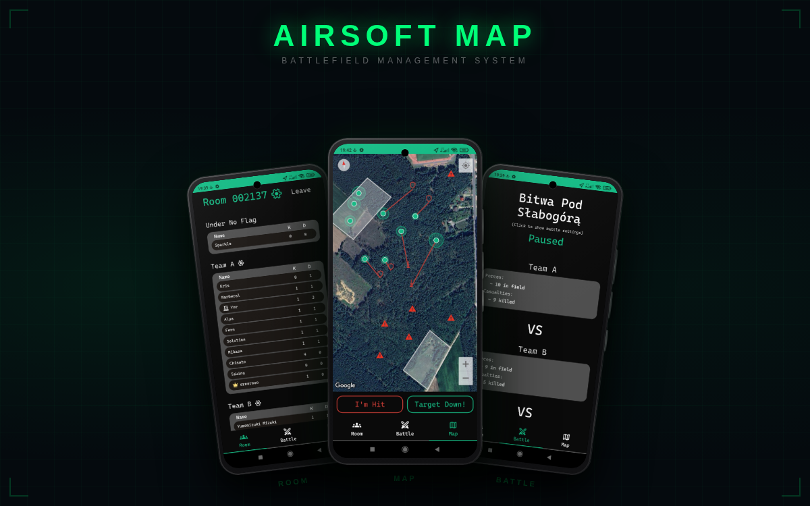

# Airsoft Map Mobile

## About

Airsoft Map Mobile is a real-time communication and battlefield management application designed for airsoft players.  
The app allows teams to coordinate during matches by sharing live locations, tracking battle status, and exchanging tactical information.

Backend repository:  
👉 [AirsoftBattlefieldManagementSystemAPI](https://github.com/ErNeRooo/AirsoftBattlefieldManagementSystemAPI)

Application showcase video:  
👉 https://youtu.be/KaQWGlp-ze4

---

## Tech Stack

- C#
- .NET MAUI
- SignalR
- xUnit

---

## Features

### Real-Time Team Communication

- Share player locations with teammates in real time
- Synchronize battle status across all connected players
- Receive live tactical updates during gameplay

### Battle Management

- Track battle states:
  - Started
  - Paused
  - Finished
- Team officers can send orders and commands to players
- Configure spawn points for each team

### Player Statistics

- Track personal battle statistics such as:
  - Kills
  - Deaths
  - Respawns

### Tactical Map System

- Mark enemy sightings on the map
- Display team positions
- Improve battlefield awareness and coordination

---

## Purpose

The goal of the project is to improve communication, coordination, and tactical awareness during airsoft games by providing a modern real-time mobile solution.

---

## Testing

The project includes unit tests written with xUnit to ensure reliability and maintainability of core functionalities.
